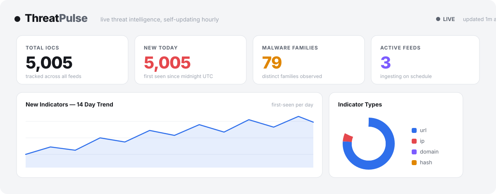

<div align="center">

# 🛰️ ThreatPulse

**A live, self-updating threat intelligence platform.**

Auto-ingests real malware feeds every hour, tracks indicators over time, and serves a
dashboard of today's active threats — a miniature, open-source OpenCTI/MISP.


[Features](#what-it-does) · [API](#-api) · [Run locally](#run-locally) · [Deploy your own](#-deploy-to-render-free)

<br/>



</div>

---

## What it does

ThreatPulse isn't a one-shot lookup tool — it's a platform that **runs on its own and gets richer over time.**

- **⏱️ Automated ingestion** — a background scheduler pulls fresh IOCs every hour from three real abuse.ch feeds: **URLhaus** (malware URLs), **ThreatFox** (IPs/domains/hashes), and **Feodo Tracker** (botnet C2 IPs). New indicators are inserted; repeat sightings bump `last_seen`.
- **📊 Live dashboard** — stat cards (IOCs tracked, new today, malware families, active feeds), a 14-day trend chart, an indicator-type breakdown, top malware families, and geographic distribution of malicious IPs.
- **🔎 IOC Explorer** — a searchable, filterable, paginated table over every indicator, with full-text search across value / family / tags.
- **🧪 On-demand enrichment** — paste any IP, domain, URL, or hash and get a **verdict card**: threat score, first/last seen, and per-source signals (local feeds + optional AbuseIPDB / AlienVault OTX).
- **⭐ Watchlists + history** — track an indicator and watch it light up as it (re)appears across feeds, with first/last-seen history.

Everything is **self-hosting-friendly** and runs on free infrastructure, updating itself 24/7.

## Architecture

```
                 ┌──────────────────────────────────────────┐
   abuse.ch      │                 ThreatPulse               │
  ┌──────────┐   │                                           │
  │ URLhaus  │──▶│  Scheduler (APScheduler, hourly)          │
  │ ThreatFox│──▶│      │                                    │
  │ Feodo    │──▶│      ▼                                    │
  └──────────┘   │  Ingest pipeline ──▶ upsert ──▶ Postgres  │
                 │                                    │       │
                 │  FastAPI  ◀────────────────────────┘       │
                 │   /api/stats  /api/iocs  /api/enrich  ...  │
                 │      │                                     │
                 │      ▼                                     │
                 │  Static dashboard (vanilla JS + Chart.js)  │
                 └──────────────────────────────────────────┘
```

**Stack:** Python · FastAPI · SQLAlchemy 2.0 · APScheduler · Postgres (SQLite locally) · vanilla JS + Chart.js. No frontend build step.

## Project layout

```
threatpulse/
├── backend/
│   ├── app/
│   │   ├── main.py            # FastAPI app + lifespan (DB init, scheduler)
│   │   ├── config.py          # env-driven settings
│   │   ├── db.py              # engine/session; postgres:// URL normalization
│   │   ├── models.py          # IOC, FeedRun, Watchlist
│   │   ├── schemas.py         # Pydantic response models
│   │   ├── scheduler.py       # hourly ingest job
│   │   ├── feeds/             # one module per feed + ingest orchestrator
│   │   │   ├── urlhaus.py  threatfox.py  feodo.py  ingest.py
│   │   ├── enrichment/
│   │   │   └── engine.py      # classify + verdict scoring
│   │   └── routers/           # stats · iocs · enrich · watchlist · admin
│   └── requirements.txt
├── frontend/                  # index.html · styles.css · app.js
├── render.yaml                # one-click Render blueprint (web + Postgres)
├── Dockerfile                 # optional container build
└── .env.example
```

## Run locally

```bash
cd backend
python -m venv .venv
# Windows: .venv\Scripts\activate   ·   macOS/Linux: source .venv/bin/activate
pip install -r requirements.txt
uvicorn app.main:app --app-dir . --reload --port 8077
```

Open **http://localhost:8077**. On first boot it ingests immediately, so the dashboard has live data within seconds. URLhaus and Feodo work with no credentials; add a free `ABUSECH_AUTH_KEY` to enable ThreatFox.

## 🚀 Deploy to Render (free)

1. Push this repo to GitHub.
2. In [Render](https://render.com) → **New +** → **Blueprint**, point it at your repo. `render.yaml` provisions the web service **and** a free Postgres.
3. (Optional) In the service's **Environment** tab, set `ABUSECH_AUTH_KEY` (from [auth.abuse.ch](https://auth.abuse.ch)) to enable the ThreatFox feed.
4. Open the public URL. Done — it now updates itself.

> **Keeping it alive 24/7 on the free tier.** Render's free web service sleeps after ~15 min idle, which pauses the in-process scheduler. To guarantee hourly updates, point a free external cron (e.g. [cron-job.org](https://cron-job.org)) at:
> ```
> POST https://<your-app>.onrender.com/api/admin/ingest
> ```
> This both wakes the service and triggers a fresh pull — so a recruiter opening the link days later still sees today's threats.

## 🔌 API

Interactive docs at `/docs` (Swagger). Highlights:

| Method | Endpoint | Description |
|--------|----------|-------------|
| `GET`  | `/api/stats` | Dashboard aggregates: cards, trend, families, types, geo |
| `GET`  | `/api/iocs?q=&ioc_type=&source=&limit=&offset=` | Searchable, paginated indicators |
| `POST` | `/api/enrich` `{"indicator": "..."}` | Verdict card for one indicator |
| `GET`  | `/api/watchlist` · `POST` · `DELETE /{id}` | Track indicators over time |
| `POST` | `/api/admin/ingest` | Trigger an out-of-band feed pull |
| `GET`  | `/api/admin/feed-runs` | Recent ingestion history & errors |

## Design notes

- **Resilient ingestion** — each feed runs in isolation; one feed failing (e.g. ThreatFox returning `401` without an auth key) never blocks the others, and every run is recorded in `feed_runs` with status and error.
- **Idempotent upserts** — uniqueness is `(value, type, source)`, so re-ingesting only refreshes `last_seen` and backfills missing fields.
- **Portable persistence** — the same `DATABASE_URL` code path runs SQLite locally and Postgres in production; `postgres://` URLs are auto-normalized for the modern `psycopg` driver.
- **Graceful enrichment** — with no third-party API keys, verdicts still draw on local feed matches and structural heuristics.

## Data sources & credit

All threat data comes from **[abuse.ch](https://abuse.ch)** (URLhaus, ThreatFox, Feodo Tracker), used under their terms for research and defensive purposes. ThreatPulse is an independent project and is not affiliated with abuse.ch.

## License

MIT — see [LICENSE](LICENSE).
